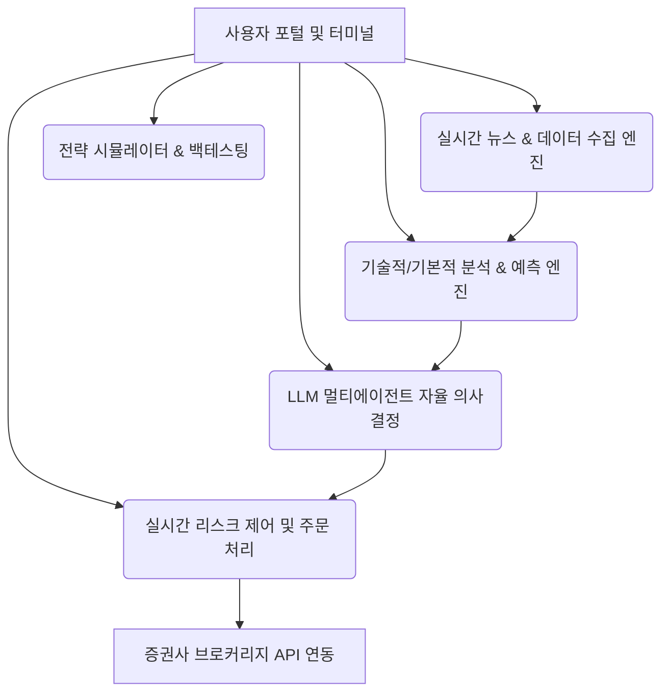

# Stock Trader AI Platform - 제품 요구사항 정의서 (PRD)

본 문서는 실시간 주식 거래 성향(스캘핑, 데이 트레이딩, 스윙 트레이딩, 포지션 트레이딩)에 특화되고 감정이 배제된 리스크 관리와 AI/LLM 에이전트 기술이 통합된 차세대 **Stock Trader AI Platform**의 제품 요구사항 정의서(PRD)입니다.

---

## 1. 제품 개요 (Product Overview)

### 1.1 배경 및 목적
주식 트레이더는 기업의 장기적 가치를 보고 투자하는 '투자자(Investor)'와 달리, **단기적 변동성을 포착하여 시세 차익**을 추구합니다. 그러나 인간 트레이더는 뇌동매매(뇌동거래), 손절 타이밍의 상실, 감정적 매매로 인해 실패할 확률이 높습니다. 본 플랫폼은 다양한 거래 성향(스캘퍼, 데이 트레이더, 스윙 트레이더, 포지션 트레이더)에 맞춤화된 전략 엔진을 제공하고, **감정을 원천 배제한 기계적 손절매(Stop-loss)** 및 **리스크 한도 제어 기능**을 실시간으로 강제함으로써 트레이더의 생존율과 수익성을 극대화합니다.

### 1.2 핵심 대상 (Target User Persona)
*   **스캘퍼 (Scalper):** 초/분 단위로 미세한 호가창 변동 및 체결량(Order Flow)을 추적하며 하루 수백 번 이상의 매매를 수행하는 극단적 단기 트레이더.
*   **데이 트레이더 (Day Trader):** 오버나잇 리스크(익일 장 시작 시 갭하락 위험)를 회피하기 위해 당일 포지션 진입 및 당일 전량 청산을 목표로 하는 일중 트레이더.
*   **스윙 트레이더 (Swing Trader):** 수일에서 수주 간 추세의 흐름(스윙)을 타고 수익을 극대화하며, 기술적 지표 및 뉴스 모멘텀을 주 무기로 삼는 트레이더.
*   **포지션 트레이더 (Position Trader):** 수개월간 거시 경제 지표(Macro), 산업 트렌드, 기업의 펀더멘털 분석을 토대로 장기적인 매매 결정을 내리는 트레이더.

---

## 2. 벤치마크 오픈소스 20선 분석 및 시사점

플랫폼 설계 및 개발 시 참고 및 내재화할 수 있는 핵심 오픈소스 20개의 현황과 활용 목적을 아래와 같이 선별하였습니다.

| 번호 | 오픈소스 프로젝트 (링크) | Stars | 핵심 기능 및 설명 | 플랫폼 벤치마킹 요소 |
|---|---|---|---|---|
| 1 | [freqtrade/freqtrade](https://github.com/freqtrade/freqtrade) | 51,152 | 설정 파일 기반의 고도화된 자동매매 봇. Dry-run, 백테스팅, 하이퍼파라미터 튜닝 지원. | 전략 파이프라인 구성 및 모의투자(Dry-run) 실행 모듈 아키텍처 벤치마킹 |
| 2 | [microsoft/qlib](https://github.com/microsoft/qlib) | 44,038 | AI 기반 퀀트 투자 플랫폼. 데이터 수집, 전처리, 예측 모델 학습, 백테스팅 전체 생태계 통합. | 머신러닝/딥러닝 기반 특징점(Feature) 추출 및 정형 데이터 분석 엔진 설계 |
| 3 | [TauricResearch/TradingAgents](https://github.com/TauricResearch/TradingAgents) | 83,014 | 멀티에이전트 LLM 금융 트레이딩 프레임워크. 에이전트 간 역할 분담을 통한 의사결정. | 뉴스, 소셜, 거시 지표 분석용 멀티에이전트 조율(Orchestration) 시스템 |
| 4 | [Fincept-Corporation/FinceptTerminal](https://github.com/Fincept-Corporation/FinceptTerminal) | 25,340 | C++ 기반 고성능 금융 터미널 대시보드. 대용량 실시간 지표 고속 렌더링. | 초저지연 시각화, 호가창(Order Book) 및 실시간 차트 렌더링 엔진 |
| 5 | [HKUDS/AI-Trader](https://github.com/HKUDS/AI-Trader) | 19,280 | Agent-Native 기반 완전 자동화 트레이딩 플랫폼. | 뉴스 기반 감성 지표 반영 및 LLM 판단을 주문으로 번역하는 커넥터 설계 |
| 6 | [NoFxAiOS/nofx](https://github.com/NoFxAiOS/nofx) | 12,486 | 미국 주식/암호화폐용 터미널 기반(TUI/CLI) AI 트레이딩 어시스턴트. | 개발자/프로페셔널 트레이더용 초고속 TUI 주문 체결 콘솔 구성 |
| 7 | [HKUDS/Vibe-Trading](https://github.com/HKUDS/Vibe-Trading) | 10,705 | 실시간 뉴스 감성 분석 기반 투자 의사결정 보조 에이전트. | 소셜 텍스트 기반 시장 모멘텀 센티먼트 지수 연동 모듈 |
| 8 | [huseinzol05/Stock-Prediction-Models](https://github.com/huseinzol05/Stock-Prediction-Models) | 9,372 | LSTM, GRU, CNN, DQN, DDPG 등 주가 예측용 딥러닝/강화학습 모델 모음. | 강화학습 기반 단기 변동성 거래 모델 및 시계열 신경망 아키텍처 학습용 |
| 9 | [AI4Finance-Foundation/FinRobot](https://github.com/AI4Finance-Foundation/FinRobot) | 7,181 | LLM을 활용한 금융 분석용 오픈소스 AI 에이전트 플랫폼. | 기업 분기 보고서(10-K, 10-Q) 자동 파싱 및 펀더멘털 스크리닝 기능 |
| 10 | [tensortrade-org/tensortrade](https://github.com/tensortrade-org/tensortrade) | 6,298 | 강화학습 기반 트레이딩 에이전트 훈련 전용 Gym 스타일 프레임워크. | 주문 수수료, 체결 슬리피지(Slippage)를 고려한 백테스팅 및 학습 환경 구축 |
| 11 | [atilaahmettaner/tradingview-mcp](https://github.com/atilaahmettaner/tradingview-mcp) | 2,997 | 실시간 주식 스크리닝, 고급 기술적 지표 계산 및 Claude 연동 MCP 서버. | TradingView 기술적 지표(Bollinger Bands, RSI 등) 실시간 수집 및 MCP 연동 |
| 12 | [Y-Research-SBU/QuantAgent](https://github.com/Y-Research-SBU/QuantAgent) | 2,714 | 퀀트 분석 자율 에이전트. 투자 철학과 전략 프로파일 유지 모듈 제공. | 유저의 매매 원칙(Risk Profile) 준수 강제를 위한 에이전트 자가 점검 루프 |
| 13 | [RKiding/Awesome-finance-skills](https://github.com/RKiding/Awesome-finance-skills) | 2,418 | 금융 분석 및 데이터 크롤링을 위한 다목적 도구 및 에이전트 스킬 모음. | 해외 증권사 데이터(REST API/WebSocket) 파싱 핸들러 및 유틸리티 |
| 14 | [FinanceData/FinanceDataReader](https://github.com/FinanceData/FinanceDataReader) | 1,495 | 한국 및 글로벌 금융 데이터 수집 라이브러리. | KOSPI, KOSDAQ, NASDAQ 등 기초 시계열 주가 데이터 적재 배치 파이프라인 |
| 15 | [LLMQuant/quant-mind](https://github.com/LLMQuant/quant-mind) | 525 | 퀀트 지식 추출 및 다차원 RAG 프레임워크. | 거시경제 공시 정보 및 중앙은행 통화정책 스케줄링 연동 RAG 모듈 |
| 16 | [JordiCorbilla/stock-prediction-deep-neural-learning](https://github.com/JordiCorbilla/stock-prediction-deep-neural-learning) | 679 | TensorFlow 기반 LSTM 주가 예측 엔진. | 초단기/단기 주가 방향성 분류 및 단기 종가 예측 모델 구축 |
| 17 | [dragon1086/prism-insight](https://github.com/dragon1086/prism-insight) | 623 | 실시간 뉴스 기반 주식 매매 추천 AI 모델. | 실시간 마켓 노이즈 필터링 및 매매 시그널(Buy/Sell/Hold) 도출 장치 |
| 18 | [xang1234/stock-screener](https://github.com/xang1234/stock-screener) | 133 | AI 챗봇이 연계된 하이브리드 종목 스캐너. | 조건식(RSI 과매도 + 골든크로스 + PER < 15) 기반 다차원 스크리닝 기능 |
| 19 | [jason8745/llm-agent-trader](https://github.com/jason8745/llm-agent-trader) | 369 | FastAPI/Next.js 기반 AI 백테스팅 및 시각화 플랫폼. | 매매 로깅, 시각적 차트 인터페이스, 성과 지표(Sharpe Ratio 등) 시각화 |
| 20 | [gameworkerkim/vibe-investing](https://github.com/gameworkerkim/vibe-investing) | 123 | 소셜 미디어 트렌드 분석 및 미국 주식/크립토 멀티 에이전트 백테스팅. | SNS(X, Reddit) 키워드 급등주 감지 모듈 및 멀티 에이전트 백테스팅 테스트 |

---

## 3. 핵심 기능 요구사항 (Functional Requirements)

본 플랫폼은 위 오픈소스들의 강점을 결합하여 6대 핵심 기능 카테고리로 나누어 기획되었습니다.

### F1. 시장 데이터 및 환경 분석 모듈 (Data Ingestion)
*   **F1.1 실시간 시세 파이프라인:** 국내(KOSPI, KOSDAQ), 해외(NASDAQ, S&P 500 등) 주요 종목의 실시간 시세 및 틱(Tick)/분/일봉 데이터를 WebSocket으로 스트리밍 수집 (`FinanceDataReader` 및 `tradingview-mcp` 구조 차용).
*   **F1.2 호가창(Order Book) 데이터 동기화:** 10호가 또는 20호가 단위 호가창 매수/매도 잔량 데이터 수집 및 실시간 스프레드 분석.
*   **F1.3 다채널 비정형 데이터 크롤러:** 실시간 뉴스(MarketWatch, Reuters), 기업 공시(DART, SEC), 거시경제 데이터(Fed 발표 등), 소셜 트렌드(X, Reddit)를 수집하여 통합 처리 파이프라인으로 전송.
*   **F1.4 MCP 기반 데이터 공급:** Claude/Gemini 등 외부 AI 모델과의 연동을 극대화하기 위한 FastMCP 기반의 주식 데이터 제공 모델 탑재 (`kospi-kosdaq-stock-server` 벤치마크).

### F2. 기술적/기본적 분석 및 시계열 예측 엔진 (Analysis & Prediction)
*   **F2.1 고속 지표 계산 모듈:** Bollinger Bands, RSI, MACD, EMA/SMA, ATR(Average True Range) 등 80가지 이상의 기술적 지표를 초 단위로 계산.
*   **F2.2 시계열 시나리오 예측:** TensorFlow LSTM, GRU 및 Transformer 기반 모델을 활용해 대상 종목의 향후 5분, 30분, 1일 가격 움직임 방향성과 확률을 분석 및 분류 (`JordiCorbilla/stock-prediction` 구조 내재화).
*   **F2.3 펀더멘털/주제 스크리너:** 80개 이상의 재무 필터(PER, PBR, ROE, 부채비율 등)와 테마/이슈 탐색 키워드를 융합한 스캐너 제공 (`xang1234/stock-screener` 아키텍처 차용).

### F3. LLM/멀티에이전트 기반 자율 거래 및 분석 도구 (LLM Multi-Agent)
*   **F3.1 멀티에이전트 협업 체계:**
    1.  *정보 수집 에이전트(Scraper Agent):* 실시간 금융 속보 요약 및 재무 보고서 분석.
    2.  *시장 분석 에이전트(Analyst Agent):* 차트 패턴 인식 및 기술 지표 기반 매수/매도 기회 포착.
    3.  *포트폴리오 설계 에이전트(Portfolio Agent):* 자산 배분 비중 조율 및 변동성 평가.
    4.  *의사 결정 에이전트(Decision Agent):* 최종 매매 시그널(진입/청산/보유) 및 비중 산정.
*   **F3.2 금융 지식 RAG (Quant RAG):** 중앙은행 금리 발표 기록, 매크로 보고서 등 대량의 비정형 금융 데이터를 RAG로 연동하여 LLM의 환각(Hallucination) 현상을 차단하고 엄밀한 분석 제공 (`LLMQuant/quant-mind` 벤치마킹).
*   **F3.3 자율 자가 교정 및 피드백 루프:** 의사결정 에이전트가 트레이더의 설정 전략을 이탈하는지 실시간 감시하는 자가 점검 로직 구축 (`Y-Research-SBU/QuantAgent` 참고).

### F4. 리스크 관리 및 거래 체결 규칙 엔진 (Risk Control & Execution)
*   **F4.1 감정 배제 기계적 리스크 엔진 (Critical):**
    *   **실시간 Stop-Loss (손절매) 강제:** 매수 단가 대비 사전에 설정된 비율(예: -2.0% 또는 ATR의 2배) 도달 시, 시스템이 AI 및 인간의 판단을 기각하고 브로커리지 API를 통해 **즉시 시장가 매도** 주문을 송출함.
    *   **Trailing Stop (추적 손절매):** 주가가 상승하여 최고점을 경신할 때마다 손절 라인을 상향 조정하여 이익을 보존하는 로직 강제.
    *   **Take-Profit (익절매):** 사전에 정의한 목표 수익률 도달 시 분할 또는 전량 매도로 이익 실현.
*   **F4.2 일일 누적 손실 한도 제한 (Maximum Daily Drawdown Limit):** 당일 총 평가 자산이 전일 대비 정의된 비율(예: -5.0%) 초과 하락 시, 당일 **추가 신규 매수를 전면 금지**하고 기존 포지션을 단계적으로 청산.
*   **F4.3 포지션 사이징(Position Sizing):** 총 자산 대비 단일 종목 투자 한도(예: 계좌의 최대 10%) 및 레버리지 사용 비율을 자동으로 제한하여 파산 리스크 통제.

### F5. 백테스팅 및 전략 평가 시뮬레이터 (Backtesting)
*   **F5.1 강화학습 기반 시장 시뮬레이터:** 단순 역사적 데이터 리플레이뿐 아니라, 매매 수수료, 호가 갭, 시장 충격(Slippage)을 시뮬레이션 환경에 반영하여 현실적인 성과 측정 (`tensortrade` 및 `microsoft/qlib` 벤치마킹).
*   **F5.2 전략 성과 및 리포팅:** MDD(최대 낙폭), 샤프 지수(Sharpe Ratio), 소르티노 지수(Sortino Ratio), 승률(Win Rate), 손익비(Profit Factor) 등 포괄적 성과 보고서 자동 생성.
*   **F5.3 백테스팅 히스토리 시각화:** 매매 시점과 시세 차트, 의사결정 에이전트의 사고 로그(Chain-of-Thought)를 통합한 시각적 타임라인 제공 (`jason8745/llm-agent-trader` 구현 차용).

### F6. 사용자 인터페이스 (User Interface)
*   **F6.1 초고속 터미널 UI (TUI):** 키보드 핫키 중심의 데이터 조회 및 주문 처리가 가능한 CLI/TUI 환경 제공. 네트워크 대역폭 소모를 최소화하고 지연을 없애 스캘퍼 및 전문 트레이더 최적화 (`NoFxAiOS/nofx` 벤치마크).
*   **F6.2 모던 모바일/웹 대시보드 (Web UI):** 실시간 차트, 포트폴리오 비중, 활성 포지션, AI 에이전트 활동 상태를 한눈에 모니터링할 수 있는 Responsive 웹 뷰 (React/Next.js).
*   **F6.3 시스템 알림 및 제어 통합:** Telegram 또는 Discord와 양방향 통신하여 실시간 매매 결과 브리핑을 수신하고, 외부에서 봇 중지/즉시 청산 등의 긴급 명령을 입력할 수 있도록 구성 (`freqtrade` 아키텍처 차용).

---

## 4. 거래 방식 및 성향(Persona)별 맞춤형 전략 구성

플랫폼은 유저가 선택한 트레이딩 페르소나에 따라 엔진의 세부 규칙을 다르게 설정합니다.

| 페르소나 | 분석 데이터 주기 | 리스크 관리 규칙 (Stop-Loss) | AI 에이전트 주력 역할 | 참고할 오픈소스 조합 |
|---|---|---|---|---|
| **스캘퍼** | 틱(Tick) 및 초 단위 데이터 | 극단적 타이트 (-0.5% ~ -1.0% 고정) 거래량 붕괴 시 즉시 청산 | 호가창 잔량 변화 모니터링 및 미시 가격 모멘텀 추출 | `FinceptTerminal` + `AI-Trader` + `nofx` |
| **데이 트레이더** | 1분 / 5분봉 데이터 | 당일 종료 30분 전(15:00) 무조건 전량 청산 (오버나잇 금지) 일일 최대 손실 도달 시 강제 셧다운 | 일중 지지와 저항 돌파 감지, 당일 실시간 톱 매크로 속보 해석 | `freqtrade` + `tradingview-mcp` + `nofx` |
| **스윙 트레이더** | 1시간 / 일봉 데이터 | ATR (Average True Range) 연동 변동성 기반 추적 손절매 (예: 2ATR) | 기술적 지표 크로싱(골든크로스 등) 및 일간 보도자료 센티먼트 평가 | `qlib` + `TradingAgents` + `prism-insight` |
| **포지션 트레이더** | 일봉 / 주봉 데이터 | 최대 허용치 폭넓게 설정 (-10% ~ -15%) 기본적 분석/분기 실적 변화 시 청산 | 기업 분기 보고서 재무 평가, 거시 경제 지표 예측 및 중장기 자산 리밸런싱 | `FinRobot` + `quant-mind` + `FinanceDataReader` |

---

## 5. 시스템 아키텍처 및 핵심 데이터 흐름

### 5.1 데이터 흐름 설계
1.  **Ingestion Phase:** `FinanceDataReader` 및 증권사 WebSocket API를 통해 가격 시세 수집. `News Scraper`를 통해 비정형 텍스트 크롤링.
2.  **Processing Phase:** 수집된 시세를 기반으로 `Technical Indicator Calculator`가 보조 지표 연산. 텍스트 데이터는 LLM Embeddings을 통해 벡터 데이터베이스(`Quant-RAG`)에 저장.
3.  **Agent Logic Phase:** `Multi-Agent Orchestrator`가 시장 상황과 유저의 페르소나 설정을 분석하여 최종 매매 신호 생성.
4.  **Risk Audit Phase:** 최종 신호가 넘어오면 `Risk Control Module`에서 '손절 라인', '일일 최대 손실', '포지션 한도' 필터를 실행하여 안전한 주문만 통과시킴.
5.  **Execution Phase:** 필터링된 주문을 브로커리지 API (예: 한국투자증권, Charles Schwab 등)를 통해 송출 및 체결 후 사용자에게 Telegram 알림.

---

## 6. 비기능 요구사항 (Non-Functional Requirements)

*   **성능 및 지연 시간:** TUI 및 백엔드 핵심 리스크 엔진은 주문 승인 판단부터 송출까지 **10ms 이내**로 처리되어야 함. 스캘핑 전략 모듈은 인메모리 큐(Redis/RabbitMQ)를 사용하여 백로그가 누적되지 않도록 보장.
*   **안정성 및 고가용성:** 브로커리지 API와의 세션 연결 유실 시, 시스템은 즉시 모니터링 경보를 울리고 **추가 신규 진입을 전면 차단**하는 Fail-Safe 모드로 자동 전환.
*   **보안:** 증권사 API Key 및 Secret Key는 로컬 환경의 암호화 보관소(예: Vault, OS Keychain)에 보안 저장하고, 외부 네트워킹을 통해 노출되지 않도록 전격 통제.

---

## 7. 개발 로드맵 및 마일스톤

*   **Phase 1 (기반 인프라 구축):** 실시간 데이터 인제스천 파이프라인 개발 (`FinanceDataReader`, WebSocket API 통합), 로컬 DB 인프라 구축.
*   **Phase 2 (기술 지표 & AI 모델 연동):** 보조지표 연산엔진 연동, LSTM 주가 예측 엔진 개발 및 LLM API(Gemini, Claude) 연동 멀티에이전트 구현.
*   **Phase 3 (리스크 엔진 및 시뮬레이터):** 강제 Stop-Loss, Trailing Stop을 포함한 리스크 감시 엔진 완성, `tensortrade` 기반 백테스팅 시뮬레이터 구축.
*   **Phase 4 (인터페이스 & 배포):** 초고속 TUI 및 웹 기반 대시보드 릴리즈, 브로커리지 주문 체결 연동 테스트 및 실거래(Live Run) 개시.
